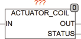

<!--
  Copyright (c) 2026 Hans Mühlbauer, Franz Höpfinger and others.

  This program and the accompanying materials are made available under the
  terms of the Eclipse Public License 2.0 which is available at
  https://www.eclipse.org/legal/epl-2.0

  SPDX-License-Identifier: EPL-2.0
-->

## Type	Function module

| | |
|:---|:---|
| **Input	IN** | BOOL (control signal) |
| **Output	OUT** | BOOL (control signal for the pump) |
| **STATUS** | BYTE (ESR compliant status output) |
| **ACTUATOR_COIL is used to control simple valves. The output OUT follows the input signal IN. If the setup variable SELF_ACT_CYCLE  set to a value greater than 0, the valve is automatically activated for the duration of SELF_ACT_TIME if it was off for the time SELF_ACT_CYCLE. An ESR compliant status output indicates state changes of the valve for further processing or Data Logging. The status messages are defined as follows** |  |
| | STATUS = 100, Standby. |
| | STATUS = 101, valve was activated by TRUE at the input IN. |
| | STATUS = 102, valve was activated automatically. |
| **Setup	SELF_ACT_CYCLE** | TIME (automatic activation time) |
| **SELF_ACT_TIME** | TIME (switch on with auto activation) |

