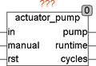

<!--
  Copyright (c) 2026 Hans Mühlbauer, Franz Höpfinger and others.

  This program and the accompanying materials are made available under the
  terms of the Eclipse Public License 2.0 which is available at
  https://www.eclipse.org/legal/epl-2.0

  SPDX-License-Identifier: EPL-2.0
-->

## Type	Function module

| | |
|:---|:---|
| **Input	IN** | BOOL (Control signal for pump) |
| **MANUAL** | BOOL (Manual control signal) |
| **RST** | BOOL (reset signal) |
| **Output	PUMP** | BOOL (control signal for the pump) |
| **RUNTIME** | REAL (engine running time in hours) |
| **CYCLES** | REAL (number of on / off cycles of the pump) |
| **Setup	MIN_ONTIME** | TIME (minimum runtime for motor) |
| **MIN_OFFTIME** | TIME (minimum stoptime for motor) |
| **RUN_EVERY** | TIME (time after that the pump runs automatically) |
| | ACTUATOR_PUMP is a pump interface with operating hours counter. The pump can be turned on with both IN or Manual. The setup variables MIN_ONTIME and MIN_OFFTIME set a minimum ON time and minimum OFF time. If the input IN reaches TRUE quicker than MIN_ONTIME, then the pump continues to run until the minimum run time is reached.  If the input IN is set longer than MIN_ONTIME to TRUE, the pump runs until IN is FALSE again. |
| | If the pump is turned on in quick succession, the pump waits until the elapsed time MIN_OFFTIME, until they turn on the pump. With the setup variables RUN_EVERY the time is defined after that the pump runs automatically when it is standing still for more than RUN_EVERY time, so a stuck of the pump can be avoided. The pump turns itself on in this case, and runs for MIN_ONTIME. By RUN_EVERY = T # 0s, the automatic activation can be switched off. |
| | An internal counter counts the pump operating hours and the number of switching cycles. Both values can be reset to zero with TRUE at input RST. The hour meter is permanently and gets not lost neither at power failure or reset.  RUNTIME  and CYCLES are both REAL values, so not the usual  Overflow happens, as happened with TIME values after 50 days. |

