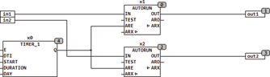
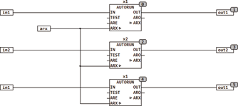

<!--
  Copyright (c) 2026 Hans Mühlbauer, Franz Höpfinger and others.

  This program and the accompanying materials are made available under the
  terms of the Eclipse Public License 2.0 which is available at
  https://www.eclipse.org/legal/epl-2.0

  SPDX-License-Identifier: EPL-2.0
-->

## Type	Function module

| | |
|:---|:---|
| **Input	IN** | BOOL (switch input) |
| **TEST** | BOOL (enables the Autorun cycle) |
| **ARE** | BOOL (  Enable  Autorun) |
| **Output	OUT** | BOOL (output to load) |
| **ARO** | BOOL (TRUE if Autorun active) |
| **AUTORUN monitors the duration of a load and ensures that the load at OUT is on, after the time TOFF at least for the time TRUN. AUTORUN stores the run time and switches the output only on, if a minimum TRUN within the period TOFF is not reached. The input IN is the switching input for the output OUT. The output ARO indicates that just Autorun is activ. The input ARE must be TRUE to enable autorun, at ARE a  Timer  can be connected to start autorun at certain times. The I/O ARX prevents if TRUE an autorun, autorun can only be active if ARI = FALSE. If ARI = FALSE and the internal Timer have expired, the module switches ARO and OUT to TRUE and at the same time ARI to TRUE. This mechanism can be used in several ways** |  |
| | a) A TRUE on the I/O  ARX can prevent an autorun, it can, for example be controlled by an external Timer and   allow the autorun only during a certain period of time. |
| | b) The ARI ports of multiple modules can be connected together and thus prevents that several modules simultaneously switch in the autorun mode. The modules wait until the first module is finished with Autorun and then the next module will begin. This is very useful to prevent that a larger number of loads perform simultaneously the autorun and therefore create unnecessarily high current load. |
| **The operating states of AUTORUN** |  |
| **A simple application of Autorun with input and output** |  |
| | In the next example, the inputs ARE (Autorun Enable ) will be released by a Timer so that autorun will run only at certain times. The autorun of the modules X1 and X2 will start at the same time. |
| | The following example shows three autorun modules that are locked on ARI each other, so that only one device can go into the autorun and the other has to wait. |
| **Setup	TRUN** | TIME (minimum duration of the load) |
| **TOFF** | TIME (Maximum lifetime of the load) |
| **I / O	ARX** | BOOL (Autorun  Enable  Signal) |

| IN | TEST | ARE | ARX | ARO | OUT |  |
| --- | --- | --- | --- | --- | --- | --- |
| X | 0 | - | - | - | X | Normal operation |
| - | 1 | - | 1 | 1 | 1 | TEST starts the Autorun cycle |
| - | 0 | 1 | 1 | 0 >> 1 | 1 | Autorun cycle is active |
