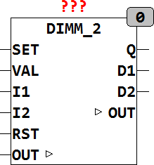

<!--
  Copyright (c) 2026 Hans Mühlbauer, Franz Höpfinger and others.

  This program and the accompanying materials are made available under the
  terms of the Eclipse Public License 2.0 which is available at
  https://www.eclipse.org/legal/epl-2.0

  SPDX-License-Identifier: EPL-2.0
-->

## Type	Function module

| | |
|:---|:---|
| **Input	SET** | BOOL (input for switching the output to VAL) |
| | VAL BYTE (value for the SET operation) |
| **I1** | BOOL (tax receipt for Taster1, On) |
| **I2** | BOOL (tax receipt for switch2, down) |
| **RST** | BOOL (entrance to switch of the output) |
| **Output	Q** | BOOL (output) |
| **D1** | BOOL (output for doubleclick at l1) |
| **D2** | BOOL (output for doubleclick at l2) |
| **I / O	OUT** | Byte (  Dimmer  Output) |
| **Setup	T_DEBOUNCE** | TIME (debounce time for buttons) |
| **T_ON_MAX** | TIME (start limitation) |
| **T_DIMM_START** | TIME (reaction time to dim) |
| **T_DIMM** | TIME (time for a dimming ramp) |
| **MIN_ON** | BYTE (minimum value of OUT at startup) |
| **MAX_ON** | BYTE (maximum value of OUT at startup) |
| **RST_OUT** | BOOL (if Reset is true, OUT is set to 0) |
| **SOFT_DIMM** | BOOL (Soft start at power-up) |
| **DBL1_TOG** | BOOL (  Enable  Toggle for D1) |
| **DBL2_TOG** | BOOL (  Enable  Toggle for D2) |
| **DBL1_SET** | BOOL (  Enable  Value for doubleclick I1) |
| **DBL2_SET** | BOOL (  Enable  Value for doubleclick I2) |
| **DBL1_POS** | BYTE (value for doubleclick at I1) |
| **DBL2_POS** | BYTE (value for double at I2) |
| | DIMM_2 is an intelligent  Dimmer  for 2-button operation. The  Dimmer  can be set via the setup variables. The time T_DEBOUNCE is used to debounce the switch and is set by default to 10ms. A start limitation T_ON_MAX switches the output off when it is exceeded. The times T_DIMM_Start and T_DIMM set the timing cycle of the  Dimmers . |
| | With the inputs of SET and RST, the output Q can be switched on or off at any time. SET sets the output OUT to the predetermined value VAL, RST sets OUT to 0 if the setup variable RST_OUT is set to TRUE. RST switches D1 and D2 in addition to FALSE. SET and RST may be used for connection of  Fire alarm systems or  Alarm systems. In case of fire or burglary all the lights can be set to On with SET or switched to off with RST when exit of the building. |
| **While switch on and of the last output value of the dimmer remains at the output OUT, only a FALSE at output Q switches the light of and a TRUE at Q switch the lamp on again. While switching on by a short press the mpodule limits the output OUT for a minimum MIN_ON and a maximum of at least MAX_ON. If, for example, the dimmer set to 0 then the module is automatically set the output OUT to 50 and vice versa, the output OUT if it is higher than MAX_ON is limited to MAX_ON. These parameters are to prevent that after switching-on a very small value at the output OUT occures and despite active Q no light is switched on. By the parameter MIN_ON a minimum value of light is defined when switched on. Conversely, for example** | the light in the bedroom is prevented to apply full brightness immediately. If the parameter SOFT_DIMM set to TRUE, the DIM starts at power on with a long button press every time at 0. In addition to the function of the dimmer, at the inputs I1 and I2 a doubleclick is decoded and puts the outputs of D1 resp. D2 for one cycle to TRUE. If the setup variable D?_TOGGLE is set to TRUE then the output D? is inverted by double-clicking. The outputs D1 and D2 can be used to to switch additional consumer or events with a double-click. An output of D? may be attributed to the SET input and the dimmer also be set to a predefined value definded by VAL using a double-click. If the setup variable DBL?_SET set to TRUE, so a corresponding double-click does not modify the associated output D? but the value of the variable DBL?_POS is passed through to the output OUT and the output Q is switched on if necessary. OUT is the value of the dimmer and is defined as an I/O variable external. This has the advantage that the value of the dimmer can be influenced externally at any time and can be reconstructed even after a power failure. OUT can be defined if desired retentive and persistent. |
| **The following table shows the operating status of the dimmer** |  |

| I1 | I2 | SET | RST | Q | D1 | D2 | OUT |
| --- | --- | --- | --- | --- | --- | --- | --- |
| single | - | 0 | 0 | 1 | - | - | LIMIT(MIN_ON,OUT,MAX_ON) |
| - | single |  |  | 0 | - | - |  |
| double | - | 0 | 0 |  | TOGPULSE |  |  |
| - | double | 0 | 0 |  |  | TOGPULSE |  |
| long | - | 0 | 0 | 1 | - |  | dimm upstart from 1 if SOFT_DIMM = TRUE |
| - | long |  |  | 1 |  |  | dimm downandturnoffat 0 |
| - | - | 1 | 0 | ON | - |  | VAL |
| - | - | 0 | 1 | OFF | OFF |  | 0 wenn RST_OUT = TRUE |
