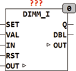

<!--
  Copyright (c) 2026 Hans Mühlbauer, Franz Höpfinger and others.

  This program and the accompanying materials are made available under the
  terms of the Eclipse Public License 2.0 which is available at
  https://www.eclipse.org/legal/epl-2.0

  SPDX-License-Identifier: EPL-2.0
-->

## DIMM_I

| | |
|:---|:---|
| **Type** | Function module |
| **Input	SET** | BOOL (input for switching the output to VAL) |
| | VAL BYTE (value for the SET operation) |
| **IN** | BOOL (control input for buttons) |
| **RST** | BOOL (entrance to switch of the output) |
| **Output	Q** | BOOL (output) |
| **DBL** | BOOL (double-click output) |
| **I / O	OUT** | Byte (  Dimmer  Output) |
| **Setup	T_DEBOUNCE** | TIME (debounce time for buttons) |
| **T_RESETUP** | TIME (reconfiguration time) |
| **T_ON_MAX** | TIME (start limitation) |
| **T_DIMM_START** | TIME (reaction time to dim) |
| **T_DIMM** | TIME (time for a dimming ramp) |
| **MIN_ON** | BYTE: = 50 (minimum value of OUT at startup) |
| **MAX_ON** | BYTE:= 255 (maximum value of OUT at startup) |
| **SOFT_DIMM** | BOOL (if TRUE dimming begins after |
| | switch on at 0) |
| **DBL_TOGGLE** | BOOL (if TRUE the output  DBL is |
| | inverted at each double-click) |
| **RST_OUT** | BOOL (if Reset is true, OUT is set to 0) |
| | DIMM_I is an intelligent  Dimmer  which automatically adjusts itself  to opening or closing switches without reconfigure. The  Dimmer  can be set via the setup variables. Over time T_DEBOUNCE the button is debounced. It is set by default to 10ms. The time variable   T_RECONFIG decide whether a open or close switch is connected at the  Input IN. If the input is longer than that defined T_RECONFIG  defined time in a state, this is assumed to rest position. If the start limitation T_ON_MAX is exceeded, it switches the output automatically of. The times and T_DIMM_Start T_DIMM sets the timing of the Dimmers  fixed. |
| | With the inputs of SET and RST, the output Q can be switched on or off at any time. SET relies on the output OUT through the by VAL predetermined value , RST sets OUT to 0 if the setup RST_OUT variable is set to TRUE. RST also switch DBL to FALSE. SET and RST may be used to connect   fire alarm systems or  alarm systems. WIth SET all the lights in an emergency case can be centrally enabled or disabled with RST when leaving the building. |
| | While switch on and of the last output value of the dimmer remains at the output OUT, only a FALSE at output Q switches the light off, and a TRUE at Q switch the lamp on again. When switching from a short press limits the module the output OUT to at least MIN_ON and maximal MAX_ON. If, for example, the dimmer to 0, the device automatically sets the output OUT to 50 and vice versa, the output OUT gets, if it is higher than MAX_ON, is limited to MAX_ON. |
| **These parameters are intended to prevent present after turning a very small value at the output OUT and Q active terms despite no light. By the parameter MIN_ON a minimum value of light is defined when switched on. Conversely, for example** | the light in the bedroom is prevented by MAX_ON to apply full brightness immediately after switch on. If the parameter SOFT_DIMM set to TRUE, the dimming starts at power on with a long button press every time at 0. In addition to the function of the dimmer a double-click on the input IN is decoded to the output DBL for one cycle to TRUE. If the setup variable DBL_TOGGLE is set to TRUE, the output DBL is inverted each time at a double click. |
| | The output DBL can be used to switch additional load or events with a double-click. The output DBL can be switched to the input SET and the dimmer can be set to a predefined value VAL using a double-click. OUT is the value of the dimmer and is defined as an I/O variable external. This has the advantage that the value of the dimmer can be changed externally at any time and can be reconstructed even after a power failure. OUT can be defined if desired retentive and persistent. |
| **The following table shows the operating status of the dimmer** |  |

| IN | SET | RST | Q | DIR | DBL | OUT |
| --- | --- | --- | --- | --- | --- | --- |
| single | 0 | 0 | NOT Q | OUT<127 | - | LIMIT(MIN_ON,OUT,MAX_ON) |
| double | 0 | 0 | - | - | TOGPULSE |  |
| long | 0 | 0 | ON | NOT DIR | - | Rampupordowndependingon DIRstartat 0 when soft_dimm = TRUE and Q = 0reversedirection if 0 or 255 isreached |
| - | 1 | 0 | ON | OUT<127 | - | VAL |
| - | 0 | 1 | OFF | UP | OFF | 0 wenn RST_OUT = TRUE |
