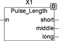

<!--
  Copyright (c) 2026 Hans Mühlbauer, Franz Höpfinger and others.

  This program and the accompanying materials are made available under the
  terms of the Eclipse Public License 2.0 which is available at
  https://www.eclipse.org/legal/epl-2.0

  SPDX-License-Identifier: EPL-2.0
-->

## Type	Function module

| | |
|:---|:---|
| **Input	IN** | BOOL (input pulse) |
| **Output	SHORT** | BOOL(pulse if IN < T_SHORT) |
| **MIDDLE** | BOOL (pulse if IN =< T_LONG and IN >= T_SHORT) |
| **LONG** | BOOL (TRUE if IN > T_SHORT) |
| **Setup	T_SHORT** | TIME (Maximum length for short pulse) |
| **T_  LONG** | TIME (minimum length for a long pulse) |
| | PULSE_LENGTH sets on an input pulse at IN one of the 3 outputs. The output SHORT is for one cycle TRUE if the input pulse is less than T_SHORT. The output  MIDDLE will TRUE for one cycle when the input pulse length is between T_SHORT and T_LONG. The output of LONG is set when the input pulse has exceeded T_LONG and remains to TRUE, as the input pulse is set to TRUE. |

