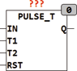

<!--
  Copyright (c) 2026 Hans Mühlbauer, Franz Höpfinger and others.

  This program and the accompanying materials are made available under the
  terms of the Eclipse Public License 2.0 which is available at
  https://www.eclipse.org/legal/epl-2.0

  SPDX-License-Identifier: EPL-2.0
-->

## PULSE_T

| | |
|:---|:---|
| **Type** | Function module |
| **Input	IN** | BOOL (input pulse) |
| **T1** | TIME (minimum time) |
| **T2** | TIME (maximum time) |
| **Output	Q** | BOOL (output pulse) |
| | PULSE_T generates an output pulse length of T2 when the input IN is less than T1 to TRUE. If the input IN for longer than T1 to TRUE, the output Q follows the input IN and is at the same time with IN set to FALSE. If IN is longer than the time T2 to TRUE, the output is after the time T2 automatically reset to FALSE. A further impulse at IN while the output is TRUE sets the output with the falling edge of IN to FALSE. Is input IN longer than the time T2 set to TRUE, the output Q automatically defaults to FALSE after the time T2 . |
| | The following chart shows the input pulse that applies to T1 longer and the output Q follows the input. Then, at input IN a short pulse (less than T1) is generated and the output remains active until a further pulse to IN resets it again. Another short pulse at the input IN sets the output to TRUE, until it will be deleted automatically after the expiry of the time T2. |

