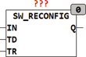

<!--
  Copyright (c) 2026 Hans Mühlbauer, Franz Höpfinger and others.

  This program and the accompanying materials are made available under the
  terms of the Eclipse Public License 2.0 which is available at
  https://www.eclipse.org/legal/epl-2.0

  SPDX-License-Identifier: EPL-2.0
-->

## Type	Function module

| | |
|:---|:---|
| **Input	IN** | BOOL (push button input) |
| **TD** | TIME (debounce time for input) |
| **TR** | TIME (reconfiguration) |
| **Output	Q** | BOOL (output) |
| | SW_RESetup is an intelligent push button interface, it can debounce the input and automatically detects whether a break contact element or closing contact is connected to the input IN. If at input IN a break contact element is detected, so the output Q is inverted. If a closing contact is connected to the input IN, the module creates for each change of state of the switch with a pulse with length TR. TD is the bounce time and TR the reconfiguration time. If the input IN remains longer than the reconfiguration time is, in a state, the output is FALSE, and will thus pass the next pulse at the input to an active high pulse. In the practical installation techniques this may be a great advantage if some switches are somtimes are break contact elements and sometimes connected as closing contact. |
| **The following chart illustrates the operation of the module** |  |

