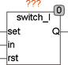

<!--
  Copyright (c) 2026 Hans Mühlbauer, Franz Höpfinger and others.

  This program and the accompanying materials are made available under the
  terms of the Eclipse Public License 2.0 which is available at
  https://www.eclipse.org/legal/epl-2.0

  SPDX-License-Identifier: EPL-2.0
-->

## Type	Function module

| | |
|:---|:---|
| **Input	SET** | BOOL (input for switching the output to 100%) |
| **IN** | BOOL (control input for buttons) |
| **RST** | BOOL (entrance to switch of the output) |
| **Output	Q** | BOOL (output) |
| **Setup	T_DEBOUNCE** | TIME (debounce time for buttons) |
| **T_RESetup** | TIME (reconfiguration time) |
| **T_ON_MAX** | TIME (start limitation) |
| | SWITCH_I is an intelligent switch which automatically adjusts to the connected switch or push-button switches. If a switch is connected, the output follows each switching edge of the switch. However, if a push-button switch is connected, SWITCH_I detects whether there is an opener or closer, and then evaluates only the first edge. The setup variable T_ON_MAX determines after which time the output is switched off automatically. With the SET and RST inputs the output can be switched at any time to 100% or off. Applications are the message of smoke detectors or alarm systems. The time T_DEBOUNCE serves to debounce the switch and is by default  set to 10ms. The time T_RESetup is used to decide whether a close switch or break switch is connected to the input IN. If the input is for more than this time in a state, it is assumed as rest mode. |

