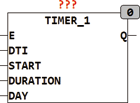

<!--
  Copyright (c) 2026 Hans Mühlbauer, Franz Höpfinger and others.

  This program and the accompanying materials are made available under the
  terms of the Eclipse Public License 2.0 which is available at
  https://www.eclipse.org/legal/epl-2.0

  SPDX-License-Identifier: EPL-2.0
-->

## Type	 Function  module

| | |
|:---|:---|
| **Input	E** | BOOL (  Enable  Input) |
| **DTI** | DATE_TIME (date time input) |
| **START** | TOD(time of day) |
| **DURATION** | TIME (duration of the output signal) |
| **DAY** | BYTE (Selection of the week days) |
| **Output	Q** | BOOL ( switch output) |
| | TIMER_1 generates at selectable days a week, an output event Q with a programmable duration (DURATION) and a fixed starting time START. DTI provides the module the local time. START and DURATION sets the time of day and duration of the event. The input DAY determines on which days of week the event is generated. IF DAY is set to 0, thus no event is produced. A DURATION = 0 indicates that the output is only set for one cycle. The resulted output signal can also run past midnight, or it may be longer than a day. The maximum pulse duration, however is 49 days (T#49d). The input DAY is of type BYTE and the bits 0..7 define the days of the event. Bit 0 corresponds to Sunday, bit 1 Saturday .. Bit 6 corresponds to Monday. If the bits 0..6 in DAY are set, so every day an event is generated, otherwise only for those days for which the corresponding bit is set. The input  Default  is, if it is not connected, set to 2#0111_1111, and thus is the module is active every day. An additional  Enable  Input E can unlock the module. This input is TRUE if it is not connected. |

