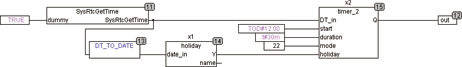

<!--
  Copyright (c) 2026 Hans Mühlbauer, Franz Höpfinger and others.

  This program and the accompanying materials are made available under the
  terms of the Eclipse Public License 2.0 which is available at
  https://www.eclipse.org/legal/epl-2.0

  SPDX-License-Identifier: EPL-2.0
-->

## TIMER_2

| | |
|:---|:---|
| **Type** | function module |
| **Input	DT_IN** | DATE_TIME (date time input) |
| **START_TIME** | TOD (start time) |
| **DURATION** | TIME (duration of the output signal) |
| **MODE** | BYTE (daily selection) |
| **HOLIDAY** | BOOL (holiday signal) |
| **Output	Q** | BOOL  (Output) |
| | TIMER_2 generates an output event with a programmable duration. DT_IN provides the building block the local time. START_TIME and DURATION specifies the time of day and the duration of the event. The input mode determines how often and on which days the event are produced.  HOLIDAY is an input signal indicating whether the current day is a holiday. This signal can be generated by the module HOLIDAY. |

**Example:**

Example of the use of TIMER_2:

The example shows the system routine (in this case for a Wago controller), which reads the internal clock and provides for DATE_TIME for TIMER_2 and HOLIDAY. HOLIDAY provides holiday information on the TIMER_2. TIMER_2 supplies in this example at weekends (Saturday and Sunday) and holidays (mode = 22) an output signal at 12:00 noon for a period of 30 minutes. TIMER_2 produces, limited by the cycle time, the exact DURATION at the output. TIMER_2 notes on which day it produced the last output pulse, thus ensuring that generates only one pulse per day.

| MODE | Q |
| --- | --- |
| 0 | no output is created |
| 1 | only on Monday |
| 2 | only on Tuesday |
| 3 | only on Wednesday |
| 4 | only on Thursday |
| 5 | only on Friday |
| 6 | only on Saturday |
| 7 | Only on Sunday |
| 11 | every day |
| 12 | every 2 days |
| 13 | every 3 days |
| 14 | every 4 days |
| 15 | every 5 days |
| 16 | every 6 days |
| 20 | Weekdays (Monday to Friday) |
| 21 | Saturday and Sunday |
| 22 | Working days (weekdays excluding public holidays) |
| 23 | Holidays and weekends |
| 24 | Only on holidays |
| 25 | First day of the month |
| 26 | Last day of the month |
| 27 | Last day of the year (December 31) |
| 28 | First day of the year (January 1) |
