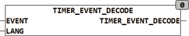

<!--
  Copyright (c) 2026 Hans Mühlbauer, Franz Höpfinger and others.

  This program and the accompanying materials are made available under the
  terms of the Eclipse Public License 2.0 which is available at
  https://www.eclipse.org/legal/epl-2.0

  SPDX-License-Identifier: EPL-2.0
-->

## Type	 Function

| | |
|:---|:---|
| **Input	EVENT** | STRING (  Event  string) |
| **LANG** | INT (language) |
| **OUTPUT** | TIMER_BOOK |
| | TIMER_EVENT_DECODE allows the programming of  Timer  Events using string instead of loading the structure TIMER_EVENT. |
| **The events are specified as follows** |  |
| | <Typ;Kanal; Day  , Start, duration, country, Lor> |
| | Field Day has, depending on the type of event different meanings and can also be specified with week as a text or a list of the week. The input LANG specifies the used language, 0 = the default language set in the setup  , 1 = english, .... more info about languages, see the section data types. |

| Element | Description | Formats |
| --- | --- | --- |
| < > | Start and stop characters of the record. |  |
| Type | Type of event (as described in TIMER_P4) | '123', 2#0101, 8#33, 16#FF |
| Channel | to be programmed channel | '123', 2#0101, 8#33, 16#FF |
| Day | Selection number eg Day | '123', 2#0101, 8#33, 16#FF, 'Mo''MO, DI, DO' |
| Start | Start time (daytime) | 'TOD#12:00' |
| Duration | Duration of the event | 'T#1h3m22s' |
| Country | And logical link | '123', 2#0101, 8#33, 16#FF |
| Lor | logical or link | '123', 2#0101, 8#33, 16#FF |
