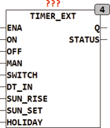

<!--
  Copyright (c) 2026 Hans Mühlbauer, Franz Höpfinger and others.

  This program and the accompanying materials are made available under the
  terms of the Eclipse Public License 2.0 which is available at
  https://www.eclipse.org/legal/epl-2.0

  SPDX-License-Identifier: EPL-2.0
-->

## TIMER_EXT

| | |
|:---|:---|
| **Type** | Function  module |
| **Input	ENA** | BOOL (module  enable  ) |
| **ON** | BOOL ( forces the output Q to TRUE) |
| **OFF** | BOOL (forces the output Q to FALSE) |
| **MAN** | BOOL (control input when ON = OFF = TRUE) |
| **SWITCH** | BOOL (push button input) |
| **DT_IN** | DATETIME (input for date and time of day) |
| **SUN_SET** | TOD (time of sunset) |
| **SUN_RISE** | TOD (time of sunrise) |
| **HOLIDAY** | BOOL (input for holiday module) |
| **Output	Q** | BOOL (switch output) |
| **Status** | BYTE (ESR compliant status output) |
| | TIMER_EXT is a  Timer  specifically for outdoor lighting or other loads are to be turned on at twilight. The output Q is at fixed times of the day ON and OFF, in addition, the output can before twilight turned ON and after twilight turned off automatically. An additional input SWITCH can switch the output, regardless of the respective time of day, on and off. The inputs ENA, ON, OFF and MAN provide a detailed automatic and manual control of the output. If ENA is not connected, the module is still  Enabled  because its internal  Default  is TRUE. The following table provides detailed information about the operating conditions of the block. |
| **The setup variables ENABLE_SUNDAY, SATURDAY and HOLIDAY define whether the block is active on Saturdays, Sundays and public holidays.  If the module should not be ON at public holidays, at the input HOLIDAY to the module HOLIDAY must be connected from the library, this module indicates a TRUE if today is a public holiday. The setup variables T_SET_START, T_SET_STOP, T_RISE_START, T_RISE_STOP, T_DAY_START and T_DAY_STOP  set the switching times. if one of those variables is T#0s or TOD#00** | 00 then the switch time is inactive. This means that ie. T_SET_START (switch before sunset) only turns on when it is set to at least 1 second. the module gets ON the output Q, at a time T_DAY_START, and in reach of T_DAY_STOP OFF again when one of the two times ( T_DAY_START or T_DAY_STOP) TOD#0:00 is and the corresponding switch process is not executed. The module switch ON at the time T_RISE_START before sunrise (SUN_RISE), and OFF  reaching of T_RISE_STOP after sunrise again. The same is for the times at sunset. |
| **Setup	HOLIDAY** | BOOL (input for holiday module) |
| **T_SET_START** | TIME (Start-before sunset) |
| **T_SET_STOP** | TIME (off time after sunset) |
| **T_DAY_STOP** | TOD (off time after daytime) |
| **T_RISE_START** | TIME (ON time before sunrise) |
| **T_DAY_START** | TOD (turn-on time of day) |
| **T_RISE_STOP** | TIME (OFF time after sunrise) |
| **ENABLE_SATURDAY** | BOOL (active on Saturdays if TRUE) |
| **ENABLE_SUNDAY** | BOOL (active on Sundays if TRUE) |
| **ENABLE_HOLIDAY** | BOOL (active on Holiday if TRUE) |

| ENA | ON | OFF | MAN | SWITCH | Timer | Q | STATUS |
| --- | --- | --- | --- | --- | --- | --- | --- |
| L | - | - | - | - | - | L | 104 |
| H | H | L | - | - | - | H | 101 |
| H | L | H | - | - | - | L | 102 |
| H | H | H | X | - | - | MAN | 103 |
| H | L | L | - |  | - | NOT Q | 110 |
| H | L | L | - | - | TOD = T_DAY_START | H | 111 |
| H | L | L | - | - | TOD = T_DAY_STOP | L | 112 |
| H | L | L | - | - | TOD = SUN_RISE - T_RISE_START | H | 113 |
| H | L | L | - | - | TOD = SUN_RISE + T_RISE_STOP | L | 114 |
| H | L | L | - | - | TOD = SUN_SET - T_SET_START | H | 115 |
| H | L | L | - | - | TOD = SUN_SET + T_SET_STOP | L | 116 |
