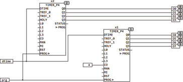
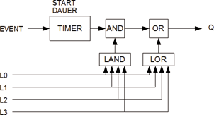

<!--
  Copyright (c) 2026 Hans Mühlbauer, Franz Höpfinger and others.

  This program and the accompanying materials are made available under the
  terms of the Eclipse Public License 2.0 which is available at
  https://www.eclipse.org/legal/epl-2.0

  SPDX-License-Identifier: EPL-2.0
-->

## TIMER_P4

| | |
|:---|:---|
| **Type** | function  module |
| **Input	DTIME** | DATE_TIME (date time input) |
| **TREF_0** | TOD (reference time 0) |
| **TREF_1** | TOD (reference 1) |
| **HOLY** | BOOL (holiday input) |
| **L0..L3** | BOOL (Logic Inputs) |
| **OFS** | INT (channel offset) |
| **ENQ** | BOOL (If ENQ = FALSE all outputs remain  FALSE) |
| **MAN** | BOOL (switch for manual operation) |
| **MI** | BYTE (channel selection for manual operation) |
| **RST** | BOOL (Asynchronous Reset) |
| **I / O	PROG** | ARRAY [0..63] OF TIMER_EVENT (program data) |
| **Output	Q0..Q3** | BOOL (switch outputs) |
| **STATUS** | BYTE (  ESR compliant status output) |
| | TIMER_P4 is a universal programmable  Timer  which has a lot of opportunities. In addition to events at fixed times, also events depending on external hours like sunrise or sunset can be programmed. In addition to the timing programm, all outputs can be linked flexible with logic inputs. Up to 63 independently programmable events  are possible, and the user has virtually unlimited possibilities. |
| | The programming of the  Timers  are done via an ARRAY [0..63] OF TIMER_EVENT. It can thereby any number of events per channel and overlapping events can be generated. |
| **The data structure TIMER_EVENT contains the following fields** |  |
| | The data field is the CHANNEL specified for the relevant event channel, if multiple channels are to be switched simultaneously per channel must be programmed in separate events. The TYPE of event determines what type of event is to be programmed, see the overview in the following table. DAY defines either a bitmask days of the week (Bit7 = MO, bit0 = SO), or the day of the month/year or a defined another number or count depending on the event type. START is the start time (TIMEOFDAY) of the event, with events as a function of an external time  START can also define a time difference. The duration defines independent of the type of event, how long the event lasts. Was an event is started the timer remembers  in the data structure each day, so that each event is run at maximum once per day. If several events per day and channel are to be defined, they can be programmed independently by multiple events. LAND and LOR define logical masks for additional logical links, a detailed description of the possible state of links is provided below in the text. |
| | The  Timer  has an additional manual input which allows to override outputs manually. If MAN = TRUE is the 4 lowest bits of the input MI are passed to the outputs Q. The input is an enable input and must be set to TRUE for normal operation, if ENQ is set to FALSE, all outputs remain at FALSE. The  Module can always be reset by means of the asynchronous input RST, here all running events are deleted. The input OFS is used only when more of the TIMER modules  are cascaded, the value of OFS then determines which channel number the first output of the module has. If OFS is set to 4 for example, so the modules does not response to the corresponding channel number 0..3 but to the channels 4..7. Thus, multiple devices are cascaded in a simple way. |
| | The STATUS output is an ESR compliant status output which reports the operating states of the module. |
| | STATUS = 100 (The module is  disabled  , ENQ = FALSE) |
| | STATUS = 101 (manual operation, MAN = TRUE) |
| | STATUS = 102 (automatic operation) |
| **The following example shows two cascaded  timers** |  |
| **Block diagram of the  timers** |  |
| | If a programmed event occurs then the corresponding  timer   of the selected channel is started with the pre-defined time period. The channel output can be linked by logical AND with up to 4 inputs L0..L3, only the inputs are associated, which are definded in the event mask LAND  with a 1 . contains the mask LAND  not a 1 (2#00000000) then no input is connected to the output.  If the mask LAND contains, for example 2#00001001) then the  output signal of  the Timer is linked with the logic inputs L0 and L3 by AND. The output in this case is only true if both an event the  Timer  has started and at the same time L0 and L3 are TRUE. After the AND link the output can be additionally connected to any logic inputs in the same manner using the mask LOR OR. |
| **The following events can be programmed** |  |
| **Event Types** |  |
| | 1. daily event |
| | at a daily event, only channel number, start time and duration of the event is programmed.  The field DAY has no meaning. |
| | 2. Event on selected days of the week |
| | at this event the  timer  is started at selectable day of the week. In field DAY is here defined by a bit mask at which days during the week days the event has to be started. Monday = bit 6,.... Sunday = bit 0. The event will start only on weekdays when the corresponding bit in field DAY is TRUE. |
| | 3. Event every N days |
| | this after a period of N days, the defined event starts. In field DAY is specified, after how many days the event starts. N = 3 means that the event will be started every 3 days. N can take this value of 1..255. |
| | 10. Weekly Event |
| **here, a event is started on a particular day in the week, the corresponding day is defined in the field DAY** | 1 = Monday ..... 7 = Sunday. |
| | 20. monthly event |
| | At monthly events in the field DAY the corresponding day of the month is defined in which the event will take place. DAY = 24 means that the event respectively at 24th of a month starts. |
| | 21. End of the month |
| | As months have no fixed length, it is also useful to generate an event on the last day of a month. In this mode the DAY has no meaning. |
| | 30. annual event |
| | At annual events, in the field DAY the corresponding day of the year is defined, in which the event starts. DAY = 33 means that each event at the 33rd day of the year starts, which corresponds to the 2nd of February. |
| | 31. End of the year |
| | As years have no fixed length, it is also useful to generate an event on the last day of the year . In this mode the DAY has no meaning. The event is produced on 31. December. |
| | 40. Event to leap days |
| | This event is only generated on 29. February, which is only in a leap year. DAY here has no meaning. |
| | 41. Event on holidays |
| | This event is only generated when the input HOLY = TRUE. At this input must be connected the module HOLIDAY from the library. If this mode is not used, the input HOLY remains open. The Field Day has no meaning here. |
| | 42. Event on holidays and weekends |
| | This event is generated when the input HOLY = TRUE, or a Saturday or Sunday is present. At this input JHOLY must be connected for this purpose the module HOLIDAY from the library. If this mode is not used, the input HOLY remains open. The Field Day has no meaning here. |
| | 43. Event during the week |
| | This event is generated only during the week days from Monday to Friday. The Field Day has no meaning here. |
| | 50. External event after time |
| **Here is generated a daily event that depends on an external time. IN field START here is not the start time itself, but rather set the offset of the external time. In field DAY is indicated the external time that is used as a reference. DAY = 0 means TREF_0, and DAY = 1 corresponds TREF_1. An event after external time, for example, is an event 1 hour after sunset. In this case, TREF_1  (DAY must be on 1) passes the time of sunset, and in the field Start the time 01** | 00 (one hour offset) is specified. The times for sunrise and sunset can be fed from the module SUN_TIME from the library. |
| | 51. Event before external time |
| **Here is generated a daily event that depends on an external time. IN field START here is not the start time itself, but rather set the offset of the external time. In field DAY is indicated the external time that is used as a reference. DAY = 0 means TREF_0, and DAY = 1 corresponds TREF_1. An event before external time, for example, is an event 1 before after sunset. In this case, TREF_1 (DAY must be on 1) passes the time of sunset, and in the field Start the time 01** | 00 (one hour offset before TREF_1) is specified. The times for sunrise and sunset can be fed from the module SUN_TIME from the library. |
| | 52 Set output after external time |
| | An event of type 52 switches the output on at reaching an external time + START. The external time is TREF1 when DAY = 1 or TREF_0 if DAY = 0. If DAY > 1 the external time is 0. The output remains then  to TRUE until it is overwritten with a new event or is deleted by a separate event. |
| | 53 Delete output with external offset |
| | An event of type 53 switches the output off at reaching an external time + START. The external time is TREF1 when DAY = 1 or TREF_0 if DAY = 0. Is DAY > 1 is the external time is 0. |
| | 54 Set output with negative offset |
| | An event of type 54 switches the output on at reaching an external time - START. The external time is TREF1 when DAY = 1 or TREF_0 if  DAY = 0. If DAY >1 the external time is 0. The output is then held to TRUE until it is overwritten with a new event or deleted by a separate event. |
| | 55 Output with negative offset |
| | An event of type 55 switches the output off when reaching the external time - START. The external time is TREF1 when DAY = 1 or TREF_0 if DAY = 0. Is DAY > 1 is the external time is 0. |

| Data field | Data Type | Description |
| --- | --- | --- |
| CHANNEL | BYTE | Channel number |
| TYPE | BYTE | Event Type |
| DAY | BYTE | Day or another number |
| START | TOD | Start time |
| DURATION | TIME | Duration of the event |
| LAND | BYTE | Mask to be logical and |
| LOR | BYTE | Mask for Logical OR |
| LAST | DWORD | Internal use |

| TYPE | Description | DAY | Start | Duration |
| --- | --- | --- | --- | --- |
| 1 | daily event | - | Start time | Duration |
| 2 | Event on selected days of the week | B0..6 | Start time | Duration |
| 3 | Event every N days | N | Start time | Duration |
| 10 | Weekly Event | Day of the week | Start time | Duration |
| 20 | monthly event | Day of the month | Start time | Duration |
| 21 | last day of the month | - | Start time | Duration |
| 30 | annual event | Day of the year | Start time | Duration |
| 31 | last day of the year | - | Start time | Duration |
| 40 | Event to leap days | - | Start time | Duration |
| 41 | Event on holidays | - | Start time | Duration |
| 42 | on holidays and weekends | - | Start time | Duration |
| 43 | Event during the week | - | Start time | Duration |
| 50 | External event after time | 0,1 | Offset | Duration |
| 51 | Event before external time | 0,1 | -Offset | Duration |
| 52 | Output to time+set offset | 0,1,2 | Offset |  |
| 53 | Output to  time + offset delete | 0,1,2 | Offset |  |
| 54 | output to time - set offset | 0,1,2 | Offset |  |
| 55 | output to time - offset delete | 0,1,2 | Offset |  |
